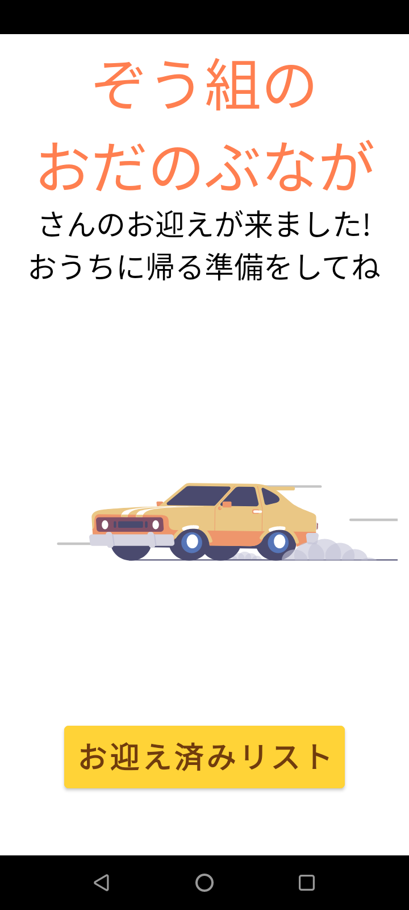
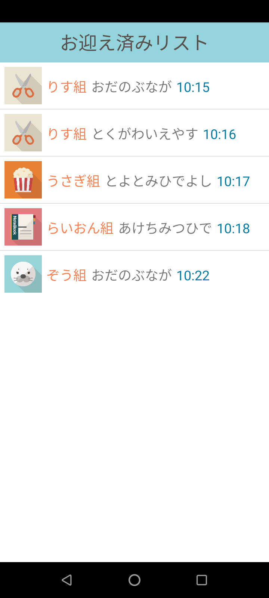

 # スマートお迎え
 ２年前期制作のAndroidアプリ 
 ３人でのグループ開発

## 成果

**信州未来アプリコンテスト　最終審査へ進出**

コンテストサイト：https://shinshu-futureapp.net/information/contest/

## 概要
保護者が保育園に近づいたら、音声でお知らせするアプリ 
保育園に設置されたWi-Fiを保護者のスマートフォンで検知し、Wi-Fi経由で保育園へ通知。音声で園児の呼び出しを行う 

protopediaリンク：https://protopedia.net/prototype/private/fda29005-2d89-4660-82d1-f336fe8a9716

youtubeリンク(操作動画)：https://www.youtube.com/watch?v=UbKBERsoMRM&t=5s

youtubeリンク(発表動画):https://www.youtube.com/watch?v=J0Vk5a_QuJw

## 使用したもの
使用言語：Java 
使用技術：Firebase,Text-toSpeech 
開発環境：AndroiStudio 

